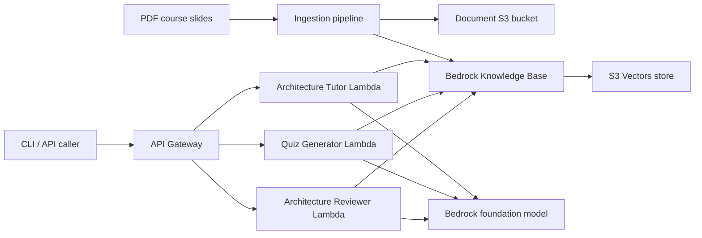

# AWS Generative AI AirLab

A local AWS developer lab for learning **Amazon Bedrock**, **RAG with Bedrock Knowledge Bases**, **S3 Vectors**, and **multi-agent architecture workflows**.

## Goals

- Build an ephemeral AWS lab that can be fully created and destroyed with CDK.
- Ingest PDF course slides into a knowledge base for retrieval.
- Provide three purpose-built agents:
  - **Architecture Tutor**: explains AWS GenAI architecture and generates diagrams
  - **Quiz Generator**: creates exam questions and evaluates answers
  - **Architecture Reviewer**: critiques and scores architecture quality

## Core AWS Services

- Amazon Bedrock
- Bedrock Knowledge Bases
- S3 Vectors
- AWS Lambda
- Amazon API Gateway
- Amazon CloudWatch
- AWS CDK

## Repository Layout

```text
aws-genai-airlab/
├── agents/
├── evaluation/
├── infrastructure/
├── knowledge_base/
├── runtime/
├── scripts/
├── tools/
├── .env.example
├── Makefile
├── README.md
└── requirements.txt
```

## Architecture (high level)



## Prerequisites

- Python 3.11+
- AWS CLI configured (`aws configure`)
- CDK bootstrap completed in your target account/region
- Bedrock model access enabled for your chosen model

## Quick Start

1. Install dependencies:

```bash
make install
```

2. Configure environment:

```bash
cp .env.example .env
# Edit .env values
```

3. Deploy ephemeral infrastructure:

```bash
make deploy
```

4. Ingest course slides (PDFs):

```bash
make ingest
```

5. Run CLI examples:

```bash
.venv/bin/python -m runtime.cli tutor --question "What is a RAG architecture on AWS?"
.venv/bin/python -m runtime.cli quiz --topic "Bedrock Knowledge Bases" --count 5
.venv/bin/python -m runtime.cli review --diagram-file sample.mmd
```

6. Destroy lab resources:

```bash
make destroy
```

## Ephemeral Infrastructure Design

- All major resources are defined in CDK in `infrastructure/stacks/airlab_stack.py`.
- S3 buckets use `RemovalPolicy.DESTROY` and object auto-delete.
- Lambda/API components are serverless (no persistent compute).
- `scripts/destroy.sh` wraps `cdk destroy --force` for full teardown.

## Notes on Bedrock Knowledge Base Provisioning

This skeleton includes a CDK custom resource Lambda (`knowledge_base/provisioner.py`) for Knowledge Base lifecycle.

- By default, `ENABLE_REAL_KB_CALLS=false` runs in dry-run mode so you can validate the full deployment pipeline without provisioning failures.
- Set `ENABLE_REAL_KB_CALLS=true` when you are ready to wire and validate account-specific KB/S3 Vectors configuration.

## Security Considerations

- Least-privilege IAM policies should be tightened before production.
- Do not commit `.env` or account secrets.
- Restrict model invocation and KB API actions to required resources.

## Evaluation

`evaluation/` includes starter RAG metrics (context precision/recall and answer relevance proxies) and a runner for JSONL datasets.

